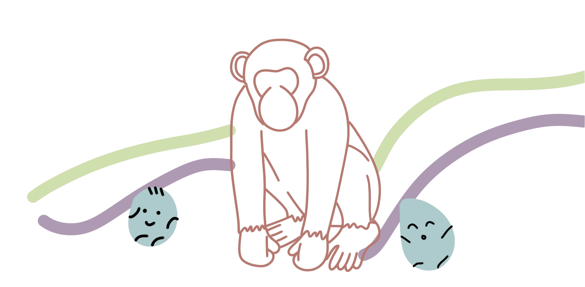

<h1 align="center">hello there  </h1>

---

---
### 🤓 &nbsp;More about me :

[Portfolio Website](https://ruishanteo.github.io)

---

### 🛠 &nbsp;Languages and Tools :

&nbsp;

  
---

<!--
**ruishanteo/ruishanteo** is a ✨ _special_ ✨ repository because its `README.md` (this file) appears on your GitHub profile.

Here are some ideas to get you started:

- 🔭 I’m currently working on ...
- 🌱 I’m currently learning ...
- 👯 I’m looking to collaborate on ...
- 🤔 I’m looking for help with ...
- 💬 Ask me about ...
- 📫 How to reach me: ...
- 😄 Pronouns: ...
- ⚡ Fun fact: ...
-->
